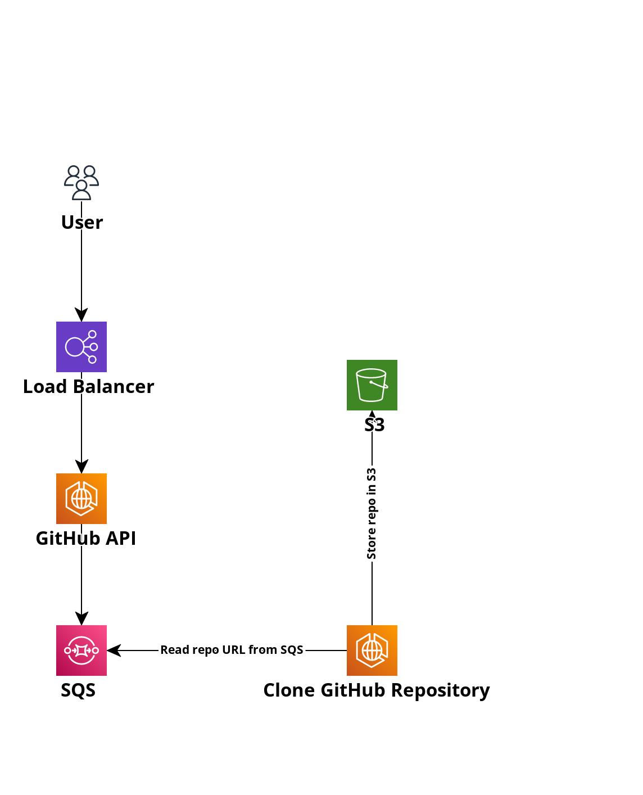

### TODO

- Read the message from SQS and get the GitHub repository URL.
- Clone the repository.
- Send the repository to a S3 bucket.

Use terraform to create the infrastructure.

### Architecture

